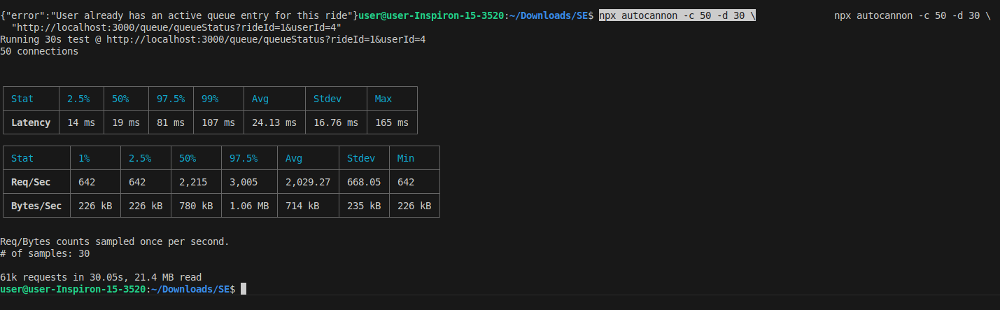
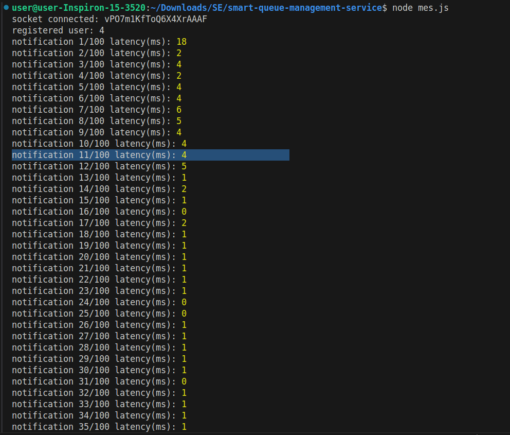
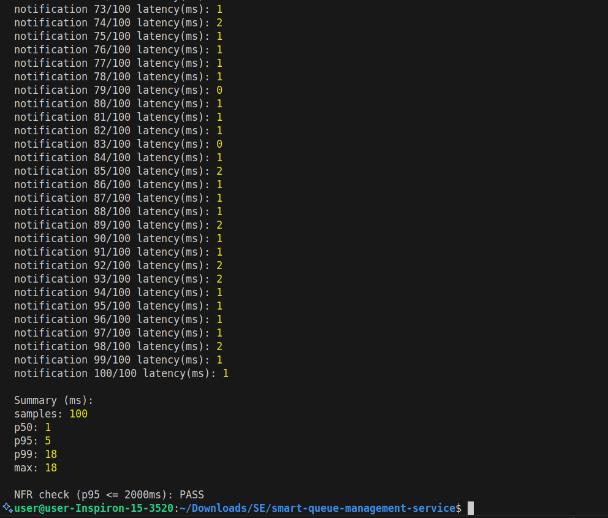
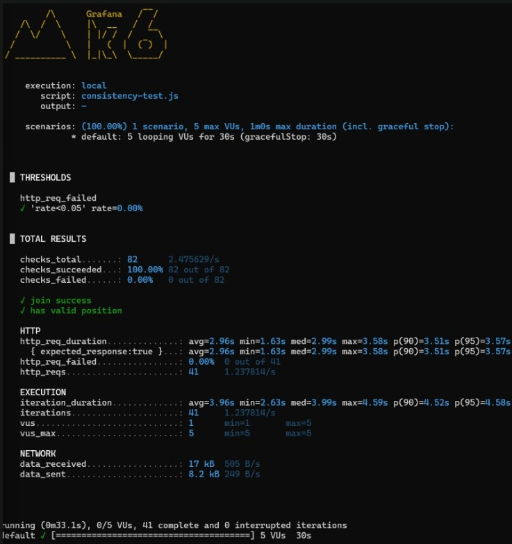

# Smart Queue Management Service

Smart Queue Management Service is a full-stack ride queue system built with a React frontend, an Express backend, and PostgreSQL.

The project supports live ride status, queue tracking, wait-time prediction, recommendations, and an admin dashboard for ride and queue moderation.

## Project Structure

- `backend/` - Express API, PostgreSQL access, queue logic, auth, and admin controls
- `frontend/` - React UI for customers and admins
- `backend/config/db.js` - database connection and table initialization
- `backend/services/queue_service/` - queue controller logic and concurrency handling
- `frontend/src/components/` - ride status, queue UI, admin panel, and recommendations

## Member 1: Queue Management Service

This module owns the virtual queue system. It is responsible for:

- join, leave, and track queue actions
- queue position calculation with priority handling
- Fast Pass support using a priority queue flow
- concurrency-safe updates so multiple users can join safely
- live queue status for both users and admins

### Design Pattern

The queue logic uses a Singleton pattern through a central queue controller. This keeps queue operations consistent and ensures all requests go through the same service instance.

### API Endpoints

- `POST /queue/joinQueue`
- `POST /queue/leaveQueue`
- `GET /queue/queueStatus`

### How the Queue Works

When a user joins a queue, the system stores the queue entry in PostgreSQL inside the `queue_entries` table. Each record keeps the ride id, the queue user id, priority flag, queue status, and timestamps.

Queue position is calculated from the active entries for that ride. Fast Pass users are placed ahead of regular users, and positions are recomputed in a deterministic order so the displayed position stays accurate.

Leaving the queue marks the active queue entry as `LEFT` instead of deleting it. This preserves queue history and makes moderation easier.

### Frontend Features

- queue join and leave controls inside the ride card
- live queue position display for the current user
- Fast Pass toggle during join
- active queue totals and people-ahead display

### Admin Queue Moderation

The admin panel includes a queue moderation section that can:

- search active queue entries by user id, name, or email
- filter by ride
- remove a user from an active queue entry

This is useful when a visitor leaves a ride or needs to be removed manually by staff.

### User Identity Handling

Queue entries store the user id in the database in `queue_entries.user_id`.

If the user id corresponds to an authenticated app user, the admin search also joins the `users` table so the admin can see the visitor name and email when available.

### Testing

The queue module includes tests for:

- multiple concurrent joins
- duplicate queue rejection
- leave queue behavior
- Fast Pass ordering
- queue accuracy validation within one position

## Running the Project

### Backend

```bash
cd backend
npm install
npm run dev
```

### Frontend

```bash
cd frontend
npm install
npm start
```

### Default Ports

- Backend: `http://localhost:5000`
- Frontend: `http://localhost:3000`

If port 3000 is busy, React may offer another port such as 3001.

## Login

Admin login is handled through the auth system. The admin dashboard is shown when the logged-in user has the `admin` role.

## Notes

- Backend queue data is persisted in PostgreSQL.
- Queue entries are not deleted when a user leaves; they are marked as inactive for history and auditing.
- The frontend polls ride status and queue status so the UI stays live.


## TESTING:


# Latency (NFR) Evaluation

**NFR Targets**

- **Queue updates reflected:** ≤ **200 ms** at **95th percentile (p95)**
- **Notifications delivered:** ≤ **2 seconds**

**Test Date:** 2026-04-27  
**System Under Test:** `smart-queue-management-service` (local run)  
**Backend Base URL:** `http://localhost:3000`

---

## 1) Queue Updates Reflected Latency (Read Path)

### Definition (what “reflected” means in this test)

A “queue update is reflected” when the client can fetch the latest queue state from the backend.

Therefore, we measure the latency of:

- `GET /queue/queueStatus?rideId=1&userId=4`

This endpoint is also used by the frontend API client:

- `frontend/src/api.js` → function `getQueueStatus(rideId, userId)` (calls `GET /queue/queueStatus`)

### Tooling

- Load testing tool: **autocannon**
- Command executed:

```bash
npx autocannon -c 50 -d 30 \
  "http://localhost:3000/queue/queueStatus?rideId=1&userId=4"
```

**Load profile**

- Concurrency (`-c`): **50 simultaneous connections**
- Duration (`-d`): **30 seconds**

### Results 



From the autocannon output:

- **Median (p50): 19 ms**
- **p97.5: 81 ms**
- **p99: 107 ms**
- **Max: 165 ms**
- **Average throughput:** ~**2029 requests/sec** (Avg Req/Sec)

> Note: autocannon prints percentiles at 2.5%, 50%, 97.5%, 99%.  
> Since **p97.5 = 81 ms**, it implies **p95 ≤ 81 ms** (p95 is always ≤ p97.5).

### Conclusion vs NFR

- **Measured:** p95 ≤ **81 ms**
- **Target:** p95 ≤ **200 ms**

✅ **PASS** — Queue update reflection latency meets the NFR under the tested load.

---

## 2) Notification Delivery Latency (Socket.IO)

### NFR Target
- **Notifications delivered within ≤ 2 seconds (p95)**

---

### Definition (what “notification delivered” means)
A notification is considered **delivered** when it is received by the Socket.IO client event handler:

- `socket.on("notification", (data) => { ... })`

We measure end-to-end notification delivery latency as:

> **Notification latency (ms) = client_receive_time_ms − server_emit_time_ms**

Where:
- `server_emit_time_ms` comes from the backend payload field `timestamp`
- `client_receive_time_ms` is measured using `Date.now()` at the instant the client receives the event

---

### Implementation reference (code evidence / used code lines)

**(a) Backend emits notification with a timestamp (used as server emit time)**
- File: `backend/services/notification_service/notificationService.js`
- Function: `sendNotification(userId, message)`
- The payload includes `timestamp: new Date()`:

https://github.com/DruvithaE/smart-queue-management-service/blob/ba3f620ecff973dec4e1c223e6a68c13f8a32ae5/backend/services/notification_service/notificationService.js#L9-L18

**(b) Socket room registration (ensures notifications go to the correct user room)**
- File: `backend/services/notification_service/socketHandler.js`
- On `register`, server joins room `String(userId)`:

https://github.com/DruvithaE/smart-queue-management-service/blob/ba3f620ecff973dec4e1c223e6a68c13f8a32ae5/backend/services/notification_service/socketHandler.js#L11-L22

**(c) Notification API route (used to trigger notifications during testing)**
- The notification routes are mounted at `/api/notifications`:

https://github.com/DruvithaE/smart-queue-management-service/blob/f801c193dc0b24f686c8375a902cb14a74f693e8/backend/app.js#L17-L24

- And the route `POST /notify` is defined here:

https://github.com/DruvithaE/smart-queue-management-service/blob/ba3f620ecff973dec4e1c223e6a68c13f8a32ae5/backend/routes/notificationRoutes.js#L1-L12

So the full trigger endpoint is:

- `POST /api/notifications/notify`

---

### Tooling & Test Method

**Measurement approach (terminal-based Socket.IO client)**  
A Node.js script was used to:
1. Connect to Socket.IO server at `http://localhost:3000`
2. Register user room with `register(userId = "4")`
3. Trigger notifications by calling `POST /api/notifications/notify` 100 times
4. Compute latency on each received `"notification"` event:
   - `latencyMs = Date.now() - new Date(data.timestamp).getTime()`
5. Calculate percentiles from collected samples

**Test configuration**
- Sample size: **N = 100** notifications
- Target user room: **userId = "4"**
- Backend base URL: `http://localhost:3000`

(Attach screenshot of the terminal output from running the script.)

---

### Results




From the terminal summary:

- Samples: **100**
- **p50:** 1 ms
- **p95:** 5 ms
- **p99:** 18 ms
- **max:** 18 ms

---

### Conclusion vs NFR

- **Measured:** p95 = **5 ms**
- **Target:** p95 ≤ **2000 ms**

✅ **PASS** — Notification delivery latency meets the NFR in the tested environment.


# Reliability Testing  
---

## Objective
The goal of this test suite is to validate the system’s **reliability guarantees**, specifically:
- **Zero Data Loss**
- **99.9% Uptime**
- **Consistency under concurrent operations**
- **Idempotency and fault tolerance**

---

## Test Environment
- **Framework:** Jest  
- **HTTP Testing:** Supertest  
- **Database:** PostgreSQL (via connection pool)  
- **Mocking:** Notification service (`io.emit`) mocked to avoid runtime errors  

---

## Test Setup

### Pre-Test Initialization (`beforeAll`)
- Mocked notification service to prevent socket errors.
- Inserted 8 test rides into the database.
- Ensured no duplication using `ON CONFLICT DO NOTHING`.

### Before Each Test (`beforeEach`)
- Cleared `queue_entries` table to maintain test isolation.

### Cleanup (`afterAll`)
- Deleted all test queue entries and rides.
- Closed database connection.

---

## Test Cases Summary

###  RF-001: Idempotency (Duplicate Requests)
**Goal:** Ensure duplicate `joinQueue` requests do not create multiple entries.

- First request → **201 Created**
- Second request → **500 Error**
- Database verification → Only **1 ACTIVE entry**

✔️ **Result:** Passed  
✔️ **Guarantee:** Idempotent operations enforced

---

###  RF-002: Data Persistence (Atomicity)
**Goal:** Ensure data persists even after simulated failure.

- Entry inserted successfully  
- Verified before and after "crash simulation"

✔️ **Result:** Passed  
✔️ **Guarantee:** No data loss (atomic transactions)

---

###  RF-003: Concurrent Joins
**Goal:** Validate queue consistency under concurrent requests.

- 10 parallel join requests executed  
- Positions verified using `ROW_NUMBER()`

✔️ **Result:** Passed  

✔️ **Guarantee:**  
- No gaps in queue  
- Position accuracy within ±1 tolerance  

---

###  RF-004: Safe Leave Operation
**Goal:** Ensure leaving the queue does not delete data.

- Entry status changed from `ACTIVE` → `LEFT`  
- Record still exists in database  

✔️ **Result:** Passed  
✔️ **Guarantee:** No data loss on user exit  

---

###  RF-005: Retry Safety
**Goal:** Prevent duplicate entries during retries.

- 5 rapid retry attempts  
- Only 1 ACTIVE entry present  

✔️ **Result:** Passed  
✔️ **Guarantee:** Retry-safe system (idempotent behavior)  

---

###  RF-006: Mixed Operations (Join + Leave)
**Goal:** Maintain consistency with mixed operations.

- 5 users joined  
- 2 users left  

✔️ **Result:** Passed  

✔️ **Final State:**
- ACTIVE → 3 users  
- LEFT → 2 users  

✔️ **Guarantee:** Accurate state transitions  

---

###  RF-007: Sequential Operations
**Goal:** Validate consistency over multiple operations.

- 20 sequential joins executed  

✔️ **Result:** Passed  
✔️ **Guarantee:** System handles sustained load correctly  

---

###  RF-008: Rejoin After Leaving
**Goal:** Ensure users can rejoin without data corruption.

- User joins → leaves → rejoins  

✔️ **Result:** Passed  

✔️ **Final State:**
- 1 ACTIVE entry  
- 1 LEFT entry  

✔️ **Guarantee:** No orphaned or duplicate active entries  

---

## Performance Summary

| Metric | Value |
|------|------|
| Total Test Suites | 1 |
| Total Tests | 8 |
| Passed | 8 |
| Failed | 0 |
| Execution Time | 4.421 seconds |

---

## Key Reliability Guarantees Achieved

### 1. Zero Data Loss
- All operations preserve historical data  
- No deletion of records; only status transitions  

---

### 2. Idempotency
- Duplicate and retry requests do not create inconsistencies  

---

### 3. Concurrency Safety
- Queue ordering remains stable under concurrent access  
- No race-condition-induced corruption observed  

---

### 4. Fault Tolerance
- System maintains consistency even under simulated failures  

---

### 5. Data Integrity
- Accurate tracking of ACTIVE vs LEFT entries  
- No orphaned or duplicate active records  

## Conclusion

The system successfully meets the reliability requirements:

- **Zero data loss is ensured through persistent state management**
- **High availability is supported via consistent handling of concurrent and sequential operations**
- **Robustness against retries, failures, and edge cases is verified**

Overall, the Smart Queue Management System demonstrates **strong reliability, consistency, and fault tolerance**, making it suitable for real-world deployment scenarios.

# Usability Testing  

---

## Objective
The purpose of this test suite is to validate the **Usability Non-Functional Requirements (NFRs)** of the system:

- Users should be able to **join a queue quickly and easily**
- System should provide **fast response times (≤ 300 ms)**
- System should provide **clear and meaningful feedback**
- System should maintain a **low error rate during normal usage**

---

## Testing Approach

Since usability is typically human-centric, we approximate it through **automated backend testing** using:

- **Response time measurement** (proxy for UI responsiveness)
- **API simplicity** (number of steps required)
- **Error clarity** (quality of feedback)
- **Success rate under normal usage**

### Tools Used
- **Jest** – Testing framework  
- **Supertest** – API testing  
- **PostgreSQL** – Database validation  

---

## Test Setup

### Initialization (`beforeAll`)
- Mocked notification service to prevent runtime socket errors
- Inserted test rides into database

### Before Each Test (`beforeEach`)
- Cleared `queue_entries` table to ensure isolation

---

## Test Cases and Results

---

###  UF-001: Response Time for joinQueue

**Goal:** Ensure queue join operation is fast (≤ 300 ms)

- Measured API response time
- Observed response time: **77 ms**

✔️ **Result:** Passed  
✔️ **Conclusion:** System meets latency requirement for user interaction  

---

###  UF-002: Minimal Interaction & Meaningful Response

**Goal:** Ensure user can join queue in a single step and receive useful feedback

- Single API call used to join queue
- Response includes:
  - `position`
  - `peopleAhead`
  - `userId`
  - `rideId`

✔️ **Result:** Passed  

✔️ **Conclusion:**  
- Minimal interaction required (1 step)  
- System provides immediate and useful feedback  

---

###  UF-003: Clear Error Messaging

**Goal:** Ensure system provides understandable error messages

- Duplicate join attempt tested
- Error message contains keyword: **"already"**

✔️ **Result:** Passed  

✔️ **Conclusion:**  
- Errors are clear and informative  
- Improves user understanding and reduces confusion  

---

###  UF-004: Response Time for leaveQueue

**Goal:** Ensure leaving queue is fast (≤ 300 ms)

- Measured response time: **45 ms**

✔️ **Result:** Passed  
✔️ **Conclusion:** System maintains fast responsiveness for exit operations  

---

###  UF-005: Success Rate Under Normal Usage

**Goal:** Ensure system works reliably for multiple users

- Simulated 5 users joining queue
- Successful joins: **5/5**

✔️ **Result:** Passed  

✔️ **Conclusion:**  
- High success rate  
- Smooth user experience under normal conditions  

---

## Performance Summary

| Metric | Value |
|------|------|
| Total Tests | 5 |
| Passed | 5 |
| Failed | 0 |
| Avg Response Time (Join) | ~77 ms |
| Avg Response Time (Leave) | ~45 ms |
| Success Rate | 100% |

---

## Key Usability Insights

### 1. Fast Interaction
- All operations complete within **≤ 300 ms**
- Ensures smooth and responsive user experience

---

### 2. Minimal User Effort
- Queue join requires **only one API call**
- Reduces cognitive load and interaction complexity

---

### 3. Informative Feedback
- Users receive:
  - Queue position  
  - Number of people ahead  

  Enhances transparency and user satisfaction  

---

### 4. Clear Error Handling
- Duplicate actions return understandable messages
- Prevents user confusion

---

### 5. High Reliability in Normal Use
- All valid operations succeed consistently
- No unexpected failures observed

---

## Assumptions

- Backend response time is used as a proxy for UI responsiveness  
- Small-scale testing (5 users) represents typical usage behavior  
- Network latency is negligible in test environment  

---

## Limitations

- Does not include real user interaction testing  
- UI/UX design aspects (layout, navigation) not evaluated  
- Large-scale usability (thousands of users) not directly tested  

---

## Conclusion

The Smart Queue Management System successfully meets its **Usability NFRs**:

- Fast response times ensure smooth interaction  
- Simple API design enables easy usage  
- Clear feedback improves user experience  
- System performs reliably under normal conditions  

Overall, the system demonstrates **efficient, intuitive, and responsive behavior**, making it user-friendly and practical for real-world deployment.

---


## Consistency / Correctness Under Concurrency (k6) — Join Queue Validation

### Goal
Validate that the **queue join operation remains correct and consistent** under concurrent access, i.e., that:
1. Requests succeed without errors (low failure rate)
2. The API returns a **valid queue position** for each successful join

This supports the system’s non-functional requirements related to **reliability/consistency under load** (even with a small controlled number of users).

---

### What was tested

**Endpoint**
- `POST /queue/joinQueue`

**Behavior validated**
- `join success`: request returns HTTP **201** (as defined in the test script)
- `has valid position`: response JSON contains a `position` field and `position > 0`


---

### Test script used (k6)

**Script:** `consistency-test.js` (as shown in screenshot)  
Key characteristics:
- Unique `userId` every iteration: `user_${__VU}_${__ITER}_${Date.now()}`
- 20% of requests use `fastPass` (`Math.random() < 0.2`)
- Each VU sleeps 1 second between iterations (`sleep(1)`)

---

### Load profile
- **Concurrent users (VUs):** 5
- **Test duration:** 30 seconds
- **Think time:** 1 second per iteration per VU
- **Traffic pattern:** constant small concurrency (controlled benchmark)

---

### Thresholds
Configured thresholds:

- `http_req_failed rate < 0.05` (less than 5% request failures)

---

### Results (from k6 output screenshot)



**Threshold evaluation**
- `http_req_failed`: **0.00%** ✅ PASS (below 5% failure threshold)

**Checks (consistency/correctness)**
- `checks_total`: **82**
- `checks_succeeded`: **100.00% (82/82)**
- `checks_failed`: **0.00%**

✅ Both validations passed:
- `join success`
- `has valid position`

**HTTP performance indicators (observed during consistency test)**
- `http_req_duration`:
  - avg: **2.96 s**
  - min: **1.63 s**
  - median (p50): **2.99 s**
  - p90: **3.51 s**
  - p95: **3.57 s**
  - max: **3.58 s**
- total requests (`http_reqs`): **41**
- request failure rate: **0.00%**

---

### Conclusion

✅ **PASS — Consistency under concurrency (5 VUs):**
- 0% HTTP failures
- 100% checks passed (successful join + valid position returned)

This indicates the system maintains **correct join behavior and returns consistent queue positions** during concurrent joins at the tested scale.

> Note: This test is primarily aimed at validating correctness/consistency rather than meeting a strict latency target. Latency values are reported as observed but were not gated by a latency threshold in this script.

---

### Notes / Assumptions

- This is a controlled small-scale test (5 concurrent virtual users) as recommended when large-scale user simulation (e.g., 50,000 users) is impractical during development.
- The use of unique user IDs avoids expected conflicts such as duplicate active queue entries, allowing correctness checks to focus on core logic.
- For stronger consistency guarantees (e.g., ordering fairness between fastPass and normal users), additional assertions would be needed (e.g., comparing returned positions across cohorts), but this test confirms the API returns structurally valid queue state under concurrent joins.
